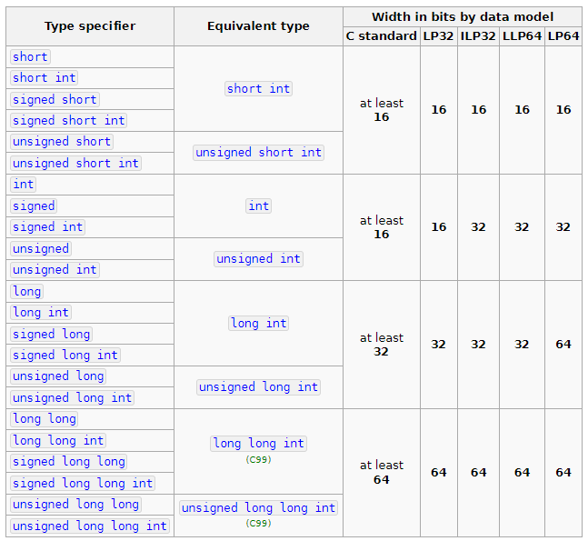
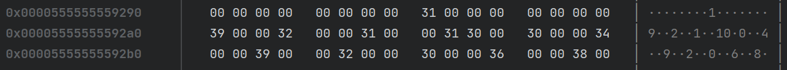
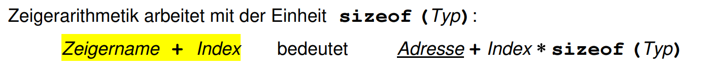

# SYPR Handbook
von Kevin Trautvetter 06.12.2022

[cppreference](https://en.cppreference.com/w/)

# C

## Einfaches Programm

```c
#include <stdio.h>

int main(void)
{
    int num = 123;
    prtinf("Meine Nummer ist: %d", num);
}
```

## Präprocessor

- Läuft, bevor das Programm kompiliert wird
- `#define`
- `#include`
- `#ifdef` `#ifndef` `#else` `#endif`

### `#include`

> **Note**
> 
> Für `.h` Datein von der std benutzt man `< >` Klammern.
> Für eigene `.h` Datein `" "`.

`#include` kopiert den Inhalt von einer Datei an der Stelle vom `#include`.

#### Beispiel

```c
// hallo.h

#include <stdio.h>

void hallo()
{
    prtinf("Hallo\n");
}
```

```c
// main.c

#include "hallo.h"

int main(void)
{
    hallo();
}
```

Nach dem Präprozessor sieht main.c so aus:

```c
// hallo.c

/* inhalt von stdio.h... */

void hallo()
{
    prtinf("Hallo\n");
}

int main(void)
{
    hallo();
}
```

### `define`

```c
#define ANSWER 42

int c = ANSWER;
```

Nach dem Präprozessor:

```c
int c = 42;
```

## Typen

- bool
- [char](#char)
- [int](#int)
- [float/double](#floatdouble)

> **Note**
> 
> Die wichtigsten Typen sind `int`, `double`, `bool` und `char`

> **Warning** 
> 
> `bool` muss in C mit `#include <stdbool.h>` included werden

### Daten modelle

#### 32 bit systems

- **LP32** or **2/4/4** (int is 16-bit, long and pointer are 32-bit)
  - Win16 API
- **ILP32** or **4/4/4** (int, long, and pointer are 32-bit);
  - Win32 API
  - Unix and Unix-like systems (Linux, Mac OS X)

#### 64 bit systems

- **LLP64** or **4/4/8** (int and long are 32-bit, pointer is 64-bit)
  - Win64 API
- **LP64** or **4/8/8** (int is 32-bit, long and pointer are 64-bit)
  - Unix and Unix-like systems (Linux, Mac OS X)

### char

`char` ist 1 Byte groß.

```c
(signed, unsigned) char
```

### int

Für int werte welche immer gleich groß sein sollen verwendet man [Fixed width integer types](https://en.cppreference.com/w/c/types/integer)

```c
(unsigned, signed) (short, long, long long) int
```



### float/double

```c
float
(long) double
```

| Typ         | Size              |
|:------------|:------------------|
| float       | binary32          |
| double      | binary64          |
| long double | binary128 oder 64 |

### `sizeof`

Mit `sizeof` bekommt man die Größe eines Typen.
```c
sizeof(int) = 4 // hängt natürlich von der platform ab
sizeof(char) = 1
```

Dies wird später nützlich, wenn wir mit malloc arbeiten.

## Zeiger und Speichermanagement

Kurz gesagt ist ein Zeiger eine kleine variable, welche die **Adresse** von anderen Daten im Speicher hat.

### Was ist Speicher

#### Stack
Wenn man variablen anlegt oder Funktionen aufruft werden diese Daten in den Stack gespeichert, schnell und einfach zu verwenden aber auch sehr klein.

#### Heap
Sehr großer Speicherplatz aber schwere Handarbeit in C



Ein Array welches Zahlen in String-Repräsentation hält (links die Adresse, dann die daten in Hex-Format, und dann ein versuch die daten zu einem ASCII String zu formatieren), wie wir sehen können befinden sich alle daten an einer bestimmten Position, die Adresse.

Wenn wir also ein `int` anlegen wird diese als 4 Bytes in den Stack gespeichert, wenn wir diesen code schreiben:

```c
int c = 1;
```

Der Stack fängt von ganz oben an, also sieht eine Adresse im Stack für gewöhnlich so aus: `0xFFFF...`. Auf dem Stack hilft es uns nicht besonders zu wissen, wo eine variable steht.

### Wieso Pointer und `malloc`

> **Note**
> 
> Um `malloc`, `calloc` und `free` zu verwenden musst du `stdlib.h` includen.

Da wir jetzt große Daten in unserem Programm verwenden wollen benötigen wir jetzt mehr Speicher. Der Stack, den wir bis jetzt immer verwendet haben, hat ja aber nur ein klein wenig Speicher. Da kommt jetzt der **Heap** ins Spiel.

### `malloc`

Um in C den Heap Speicher zu reservieren, rufen wir `malloc` auf.

`malloc` will einfach nur die Größe deiner Daten als Parameter.

```c
int *pointerZuInt = (int*) malloc(sizeof(int));
```

`int*` ist jetzt der neue typ unserer variable. Das heißt wir haben einen Pointer, welcher zu einem `int` führt. Der rückgabe**typ** von malloc ist jetzt aber `void*`. `void*` ist ein spezieller Pointer, welcher zu allen möglichen Typen zeigen könnte, aber wir wissen, dass wir jetzt einen Speicher der Größe von `int` genommen haben, weswegen wir das Ergebnis von `malloc` noch in `int*` casten müssen, um C beschwerden aus dem Weg zu gehen.

### `calloc`

`calloc` ist hilfreich für Arrays weil wir zuerst angeben wie viele Elemente wir haben wollen und dann die größe von dem Elememten.

```c
int *pointerZuInt = (int*) calloc(1, sizeof(int)); // speicher für ein int
int *pointerArray = (int*) calloc(5, sizeof(int)); // speicher für int[5]
```

`calloc` setzt den ganzen reservierten Speicher zu 0. `00000000...`

### Operatoren für Pointer

Für die Adresse von einem Wert benutze `&`
```c
int a = 123;
int *ptr = &a; // den müssen wir jetzt nicht `free`en weil a auf dem Stack ist
```

Um den Wert von einem Pointer zu erhalten benutze `*`
```c
int a = 123;
int *ptr = &a;
int b = *ptr; // b == a
```

### free
Immer wenn man fertig mit dem Speicher ist, `free` aufrufen.

> **Warning**
> 
> Das Programm kann an vielen stellen enden. Also immer vorsichtig und überall `free` aufrufen.

> **Note**
> 
> Arrays von Zeigern, z.B. `char**`, müssen erst alle Elemente mit einer `for` ge`free`'d werden und dann das Array selbst.
> ```c
> for (int i = 0; i < arrSize; ++i)
> {
>     free(arr[i]);
> }
>free(arr);
> ```


### Array
Um ein Array in C zu erstellen, sagen wir einfach "ich will 3 `int`s speichern".

```c
int *intArray = (int*) malloc(sizeof(int) * 3);
// oder
int *intArray = (int*) calloc(3, sizeof(int));
```

Dann um den Elementen einen Wert zu geben, schreiben wir:

```c
*(intArray + 0) = 123; // intArray[0]
*(intArray + 1) = 456; // intArray[1]
*(intArray + 2) = 789; // intArray[2]
```



oder das Gleiche mit der Array Schreibweise:
```c
intArray[0] = 123;
intArray[1] = 456;
intArray[2] = 789;
```

> **Warning**
> 
> Nicht vergessen!
> ```c
> free(intArray);
> ```

### Array (Stack)
Alternativ können Arrays auch auf dem Stack gespeichert werden.

> **Warning**
> 
> Nur kleine Arrays auf den Stack speichern.

```c
int arr[] = {1, 2, 3, 4};
const size_t arrSize = sizeof(a) / sizeof(int);
```

`arr` ist das gleiche wie `&arr[0]`

## String
Strings sind `char` Arrays mit `\0` am Ende. z.B. `Hallo\0`. Also immer daran denken genug Speicher für das `\0` zu machen.

Der typ von einem String ist für gewöhnlich `const char*`, bei literalen, oder einfach nur `char*` wenn man selber mit dem String arbeiten.

```c
#include <stddef.h>
#include <stdio.h>
#include <stdlib.h>

int main(void)
{
    const char* hallo = "Hallo"; // die chars sind const
    // hallo[0] = 'q'; error: assignment of read-only location '*hallo'
    char* const hallo2 = NULL; // der pointer, hallo2, ist const
    // hallo2 = "Guten Tag."; error: assignment of read-only variable 'hallo2'

    int size = 20;
    char* str = (char*) calloc(size, sizeof(char));
    for (int i = 0; i < size - 1; i++) {
        str[i] = 'A';
    }
    str[size - 1] = '\0'; // 19 mal A, 1 mal \0

    printf("%s %s\n", hallo, str);
    free(str);
}
```
Output:
```
Hallo AAAAAAAAAAAAAAAAAAA
```

## Args

```c
// args.c

#include <stdio.h>

int main(int argc, char *argv[])
{
    for (int i = 0; i < argc; ++i)
    {
        printf("argv %d: %s\n", i, argv[i]);
    }
}
```

`gcc args.c -o args; ./args test hello hello`

Output:

```
argv 0: ./args
argv 1: test
argv 2: hello
argv 3: hello
```

## Enum und `typedef`
```c
#include <stdio.h>

enum uhh
{
    hallo, // = 0
    ding, // = 1
};

int main(void)
{
    enum uhh wert;
    wert = hallo;

    printf("%d\n", wert);
}
```

Output:

```
0
```

### Alternativer Code mit `typedef`

```c
#include <stdio.h>

enum uhh
{
    hallo, // = 0
    ding, // = 1
};

typedef enum uhh uhh; // definiere: enum uhh → uhh

int main(void)
{
    uhh wert;
    wert = hallo;

    printf("%d\n", wert);
}
```

> **Warning**
> 
> `typeof` kann alle möglichem typen definieren:
> ```c
> typedef int my_cool_int;
> my_cool_int c = 123;
> ```

## Struct
```c
struct person
{
    int age;
    char gender;
};

typedef struct person person; // struct person -> person

int main(void)
{
    person pep;
    pep.age = 19;
    pep.gender = 'M';
}
```

### Struct mit pointer

Bei Pointern muss man mit `->` arbeiten:

```c
#include <stdlib.h>
#include <stdio.h>

struct person
{
    int age;
    char gender;
};

typedef struct person person; // struct person -> person

int main(void)
{
    person *pep = (person*) malloc(sizeof(person));
    pep->age = 19;
    pep->gender = 'M';

    printf("age: %d, gender: %c", pep->age, pep->gender);

    free(pep);
}
```

## Header Datei

> **Note**
> 
> **Header Datei definiert. C Datei implementiert.**

Eine Header Datei benötigt auch einen Header-Guard, um nicht mehrmals included zu werden.

```c
// util.h
#ifndef UTIL_H
#define UTIL_H

void hallo();

struct etwas
{
    int n;
};

typedef struct etwas etwas;

#endif
```

```c
// util.c

#include "util.h"

#include <stdio.h>

void geheimesHallo()
{
    printf("Hallo!\n");
}

void hallo()
{
    geheimesHallo();
}
```

```c
// main.c

#include "util.h"

int main(void)
{
    hallo();
    // geheimesHallo(); // nicht definiert
    
    etwas e;
    e.n = 123;
}
```

Um das Programm zu kompilieren, ruft man `gcc` so auf:
```bash
gcc main.c -o main.o -c
gcc util.c -o util.o -c
gcc util.o main.o -o main
./main
```

## Anonyme Union

`union` nimmt nur eine variable. Im beispiel kann leistung entweder nur eine note **oder** eine beurteilung haben. Die größe ist der Typ der größten variable.

```c
struct leistung
{
    union
    {
        int note; // 4 byte
        char beurteilung; // 1 byte
    }; // union ist 4 byte
};
```

Aber wir wissen nicht, ob wir eine note oder eine beurteilung haben, da müssen wir ein `enum` verwenden.

```c
enum leistungsart
{
    benotet, // hat eine note
    unbenotet, // hat eine beurteilung
};

struct leistung
{
    enum leistungsart typ; // 4 byte
    union
    {
        int note; // 4 byte
        char beurteilung; // 1 byte
    }; // union ist 4 byte
};
```

## ANSI-C

#TODO

ANSI-C hat einige limitationen:

- alle variablen in einer funktion müssen sich am anfang der funktion befinden
- es gibt kein long long

## Beendendes Beispiel `ist_ain2_modul`

```c
#include "spo3_ain2.h"  
#include <string.h>  
#include <stddef.h>

bool ist_ain2_modul(const char *modul)  
{  
    static const char *faecher[] = {"Mathematik 2", "Programmiertechnik 2", "Rechnerarchitekturen", "Stochastik", "Systemprogrammierung", NULL};  
  
    const char **q = faecher;  
	while (*q != NULL)
	{
	    if (strcmp(modul, *q) == 0) return true;
	    q = q + 1;
	}
  
    return false;
}
```

alternative Lösung:

```c
#include "spo3_ain2.h"  
#include <string.h>  
#include <stddef.h>

bool ist_ain2_modul(const char *modul)
{
    static const char *faecher[] = {"Mathematik 2", "Programmiertechnik 2", "Rechnerarchitekturen", "Stochastik", "Systemprogrammierung", NULL};

    const char *q = faecher[0];
    for (int i = 1; q != NULL; i++)
    {
        if (strcmp(modul, q) == 0) return true;
        q = faecher[i];
    }

    return false;
}
```
